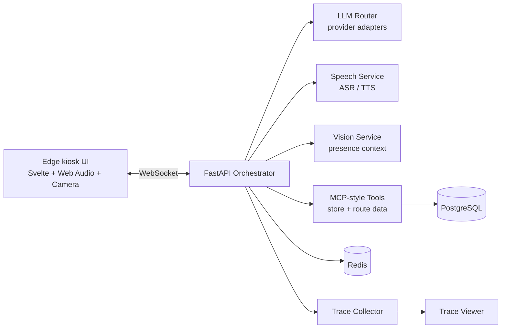

# AI Kiosk Agent Platform

Portfolio-ready architecture for a **conversational AI kiosk**: a lightweight edge UI connected to backend services for orchestration, voice, vision, tools, tracing and operational data.

This is not a prompt-only chatbot demo. It shows the engineering around a real AI system: service boundaries, WebSockets, adapters, state, latency, tool execution, testing and observability.

---

## What it demonstrates

- Svelte kiosk UI for an edge device such as a Raspberry Pi
- FastAPI WebSocket orchestrator for real-time sessions
- Speech service with ASR/TTS provider abstraction
- Vision/presence service boundary
- MCP-style tools service over structured business data
- Redis/PostgreSQL deployment architecture
- Tracing, waterfall analysis and golden-flow testing
- Practical end-to-end thinking across UI, backend, AI, data and operations

---

## Architecture



The edge client stays lightweight. Heavy processing, tools, tracing and provider integrations run in backend services.

---

## Repository structure

```text
apps/ui-kiosk          Svelte kiosk UI
apps/trace-viewer      Trace/waterfall viewer
services/orchestrator  FastAPI WebSocket orchestrator
services/speech        ASR/TTS service boundary
services/vision        Presence/vision service boundary
services/mcp-tools     Tool service over structured data
services/shared        Shared tracing utilities
packages/shared-types  Shared TypeScript message contracts
data/seeds             Synthetic demo data
tests/golden_flows     Conversation flow validation
infra                  Docker Compose and service images
```

---

## Tech stack

**Frontend:** Svelte, TypeScript, Vite, Web Audio API, WebSockets  
**Backend:** Python, FastAPI, Pydantic, SQLAlchemy, async services  
**AI systems:** LLM adapters, tool calling, ASR/TTS adapters, VAD, vision boundary  
**Infra:** Docker Compose, Redis, PostgreSQL, Linux/VPS-oriented deployment  
**Quality:** golden flows, trace analysis, unit/integration test structure

---

## Local setup

Requirements:

- Node.js 20+
- pnpm 8+
- Python 3.11+
- Docker 24+
- Go Task 3+

```bash
cp .env.example .env
cp apps/ui-kiosk/.env.example apps/ui-kiosk/.env
cp services/orchestrator/.env.example services/orchestrator/.env
cp services/mcp-tools/.env.example services/mcp-tools/.env
pnpm install
```

Start backend dependencies and services:

```bash
task dev:vps
```

Start the kiosk UI:

```bash
task dev:ui
```

Run checks/tests:

```bash
task test
```

External AI/voice providers are optional and must be configured with your own API keys. This public portfolio edition contains no production secrets, no real client data and no private media assets.

---

## Suggested screenshots for GitHub

Add these to `docs/assets/` before publishing the final repo:

1. kiosk UI in idle/listening/thinking/speaking states;
2. a simulated conversation turn;
3. route/action overlay;
4. trace viewer waterfall;
5. real photo or diagram of the physical kiosk/prototype if available.

---

## Portfolio note

This repository is a sanitized portfolio edition. The goal is to show architecture, service boundaries and implementation patterns without exposing private client data, production configuration or internal planning material.

## License

MIT for the portfolio code and documentation in this repository. Third-party APIs, models and assets may have their own licenses.
